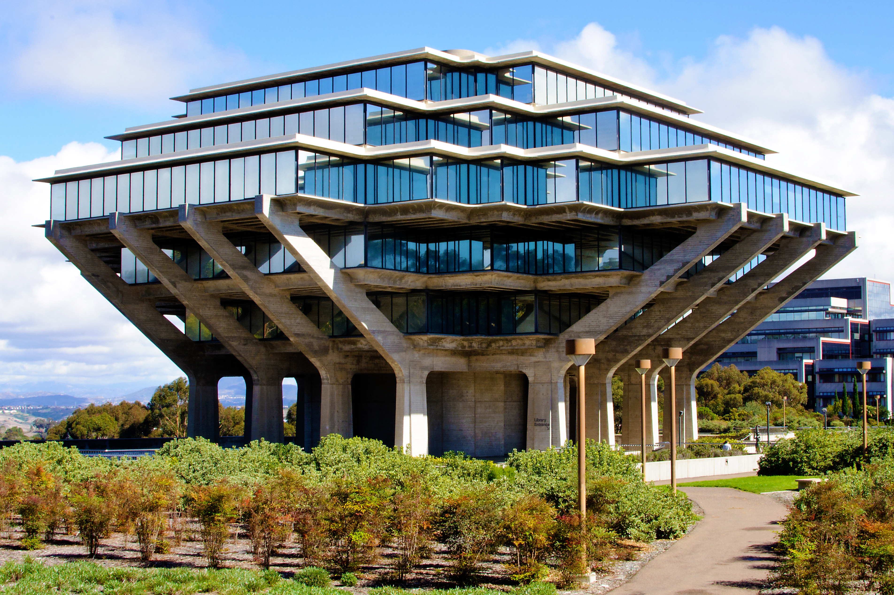

# **Jenny Nguyen** <br /><sub> _UCSD Year 3 Student | Computer Science Major_ </sub>

<br /><sub>"UCSD Library" by Dirk DBQ is licensed under CC BY 2.0</sub>

## Biography
> I'm a third year student studying for my B.S. in Computer Science. Within the field, I am interested in learning more about artificial intelligence and cyber security, though I want to keep my options open and continue to explore different specializations. At the moment, I am also considering a minor in environmental studies and/or pursuing my master’s. Outside of school, I sketch and paint in my free time, but recently, I’ve also been looking into doing digital illustration.

## Programming Languages (ordered by first to last learned)
1. [Java](#first-code-java)
2. [Python](README.md)
3. C
4. C++

## Upper Division Core Topics
- [x] Advanced Data Structures and Programming
- [x] Design and Analysis of Algorithms/Theory
- [x] Theory of Computability/Algorithms
- [ ] Software Engineering
- [ ] Systems/Networks
- [ ] PL/Databases
- [ ] Security/Crytography
- [x] Learning/Vision/Graphics
- [x] Hardware
- [x] Architecture

## First Code (Java)
```
public class MyClass {
    public static void main(String[] args) {
        System.out.println("Hello World");
    }
}
```
## Contact
- Email: jen013@ucsd.edu<br />
- GitHub: [https://github.com/jen013](https://github.com/jen013/)
